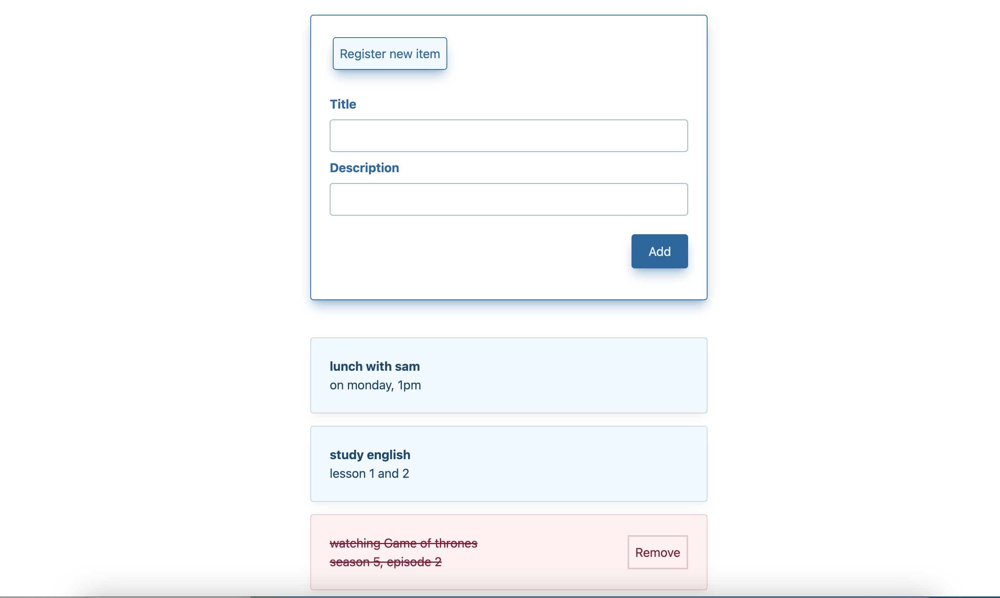

# Todo-List
> This app is a simple to-do list with the ability to add new items.
Each item can be toggled between "done" and "not done."On 'done' items, there is a remove-button, and when the user hits it, the item is totally deleted from the list. Items marked as 'done' show at the bottom of the list.

## Table of Contents
* [General Info](#general-information)
* [Technologies Used](#technologies-used)
* [Screenshots](#screenshots)
* [Setup](#setup)
<!-- * [License](#license) -->

## General Information
- A form input allows the user to add a new card.
- When a user submits a new card via the form, it is added to the list.
- Each card can be toggled between "done" and "not done."
- On 'done' cards, there is a remove-button, and when the user hits it, the card is totally deleted from the list.
- Cards marked as 'done' appear at the bottom of the list and SHOULD be visually distinct.
- If you toggle a card to 'done' and then back, the original order of the cards is preserved.
- Cards may be easily added, toggled, and removed. For example, if you want to add a new card, press the 'Enter' button
- This app has a mobile first approach.
- The app's design was fully created with Tailwindcss.
<!-- You don't have to answer all the questions - just the ones relevant to your project. -->

## Technologies Used
- TypeScript
- HTML
- Tailwind

## Screenshots

<!-- If you have screenshots you'd like to share, include them here. -->

## Setup
 Project requirements/dependencies are all listed in package.json file.

<!-- Optional -->
<!-- ## License -->
<!-- This project is open source and available under the [... License](). -->

<!-- You don't have to include all sections - just the one's relevant to your project -->